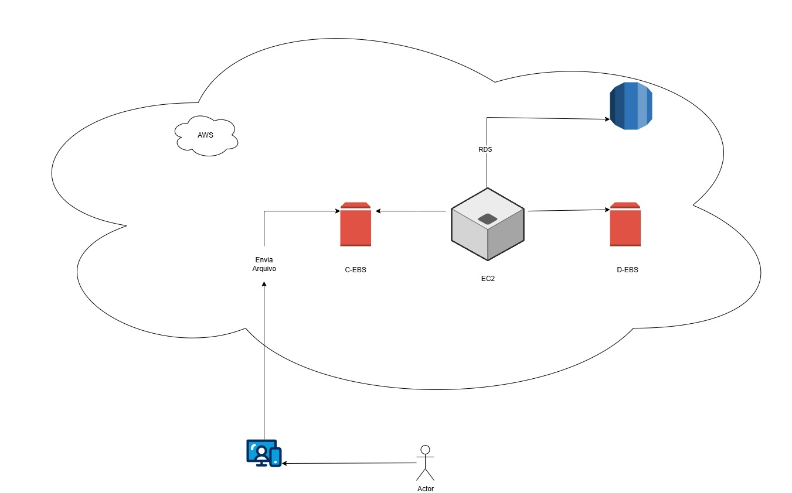

# Arquitetura-aws

# Arquitetura de Processamento de Arquivos em AWS Simplificada

## Visão Geral

Este diagrama representa uma arquitetura básica e simplificada para o recebimento, processamento e armazenamento de arquivos utilizando serviços essenciais da Amazon Web Services (AWS). O objetivo principal é ilustrar o fluxo de um arquivo desde o upload inicial por um ator externo até o processamento por uma instância de computação (EC2) e o armazenamento de dados.

O diagrama a seguir ilustra o fluxo de dados do nosso sistema AWS:

## Componentes da Arquitetura

A arquitetura está contida em um contêiner que representa a **AWS** (Nuvem).

| Componente | Tipo | Descrição |
| :--- | :--- | :--- |
| **Actor** | Usuário/Sistema | Entidade externa que inicia o processo de envio de arquivo. |
| **Computador/Terminal** | Interface | Dispositivo ou sistema utilizado pelo Ator para iniciar o **Envio Arquivo**. |
| **Envio Arquivo** | Processo/Gateway | Representa o ponto de entrada ou o processo inicial de ingestão do arquivo na nuvem AWS. |
| **C-EBS (EBS de Entrada)** | Armazenamento (Volume) | Volume de armazenamento Elastic Block Store (EBS) que pode ser anexado à EC2, servindo como a área de *staging* ou de entrada para o arquivo a ser processado. |
| **EC2** | Computação | Instância Elastic Compute Cloud, o motor de processamento central. É aqui que a lógica de negócio (ex: validação, transformação, etc.) é executada no arquivo de entrada. |
| **D-EBS (EBS de Saída)** | Armazenamento (Volume) | Volume de armazenamento EBS que pode ser anexado à EC2, utilizado para armazenar resultados intermediários ou arquivos processados que serão movidos para o RDS. |
| **RDS** | Banco de Dados | Serviço Relacional de Banco de Dados. Utilizado para armazenamento persistente e estruturado dos dados resultantes do processamento do arquivo. |

## Fluxo de Processamento (Passos)

O fluxo de dados/arquivo segue a seguinte sequência:

1. **Início:** O **Actor** interage com o **Computador/Terminal** para iniciar o processo de **Envio Arquivo**.
2. **Ingestão:** O **Envio Arquivo** direciona o arquivo para o ambiente AWS, tipicamente para um serviço de armazenamento temporário ou uma fila (não visível, mas inferível) que alimenta o **C-EBS**.
3. **Processamento:** A instância **EC2** acessa o arquivo no volume **C-EBS**. A **EC2** executa o código de processamento no arquivo (ex: extração de dados).
4. **Armazenamento Intermediário:** O resultado do processamento da EC2 pode ser salvo temporariamente no **D-EBS**.
5. **Persistência de Dados:** Após o processamento (e potencialmente usando dados do D-EBS), a **EC2** estabelece uma conexão com o **RDS** (via protocolo de rede) para gravar os dados estruturados finais no banco de dados.

## Casos de Uso Potenciais

* **ETL Simples:** Ingestão de *logs* ou arquivos CSV/JSON para processamento e inserção em um banco de dados relacional.
* **Processamento de Mídia:** Upload de uma imagem/vídeo para processamento (redimensionamento, *encoding*) em EC2, com metadados armazenados em RDS.
* **Validação de Documentos:** Recebimento de um documento, validação de formato e conteúdo na EC2, e registro do status e dados-chave no RDS.

